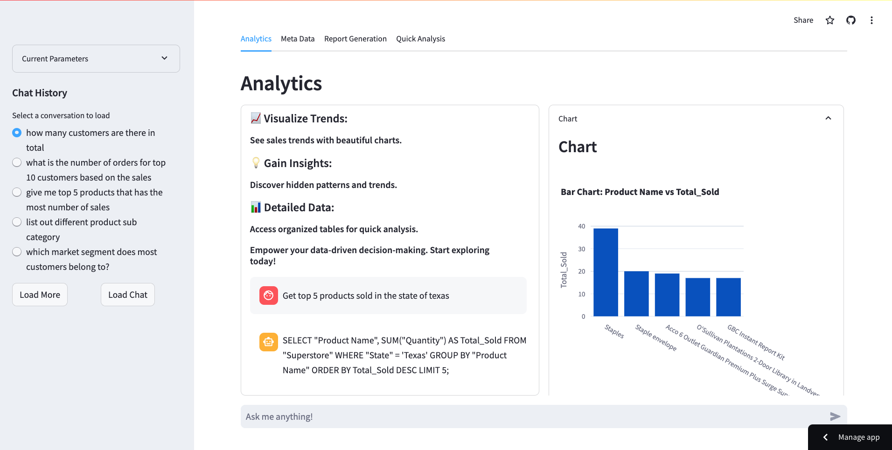
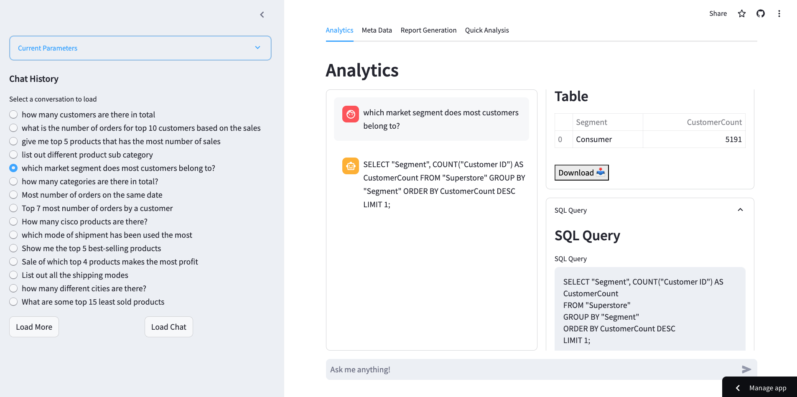
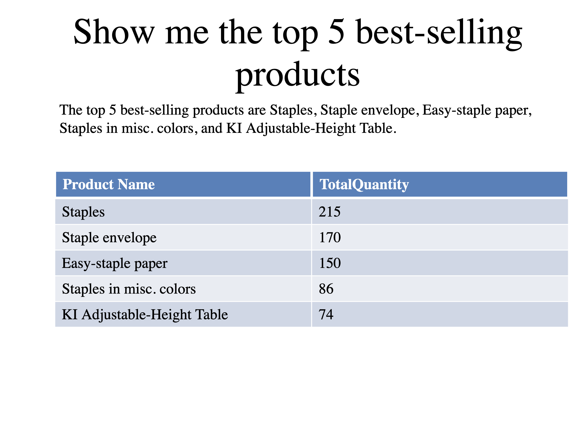
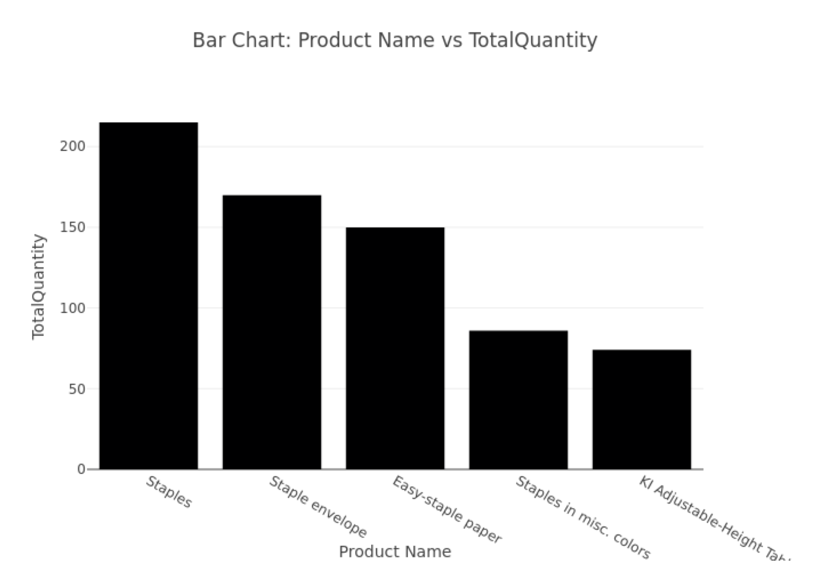

# Conversational Analytics

## Overview

Conversational Analytics is a Streamlit-based web application that allows users to explore and analyze sales data from a Superstore dataset using natural language queries. The application provides instant insights, visual trends, and detailed data analysis through a user-friendly interface.

## Features




- **Instant Queries**: Effortlessly transform your questions into SQL queries and receive immediate responses.
- **Visualize Trends**: Uncover sales trends through visually appealing and interactive charts.
- **Gain Insights**: Discover hidden patterns and trends.
- **Detailed Data**: Access and analyze organized tables for in-depth data exploration.
- **Chat History**: Keep track of your past queries and load previous conversations easily.
- **Report Generation**: Generate reports based on selected parameters and download CSV files.
- **Quick Analysis**: Conduct swift analysis on the dataset to obtain rapid insights.

## Installation

1. **Clone the repository**:
    ```sh
    git clone https://github.com/sankalpvk18/conversational-analytics.git
    cd conversational-analytics
    ```

2. **Create and activate a virtual environment**:
    ```sh
    python3 -m venv .venv
    source .venv/bin/activate  # On Windows, use `.venv\Scripts\activate`
    ```

3. **Install the required packages**:
    ```sh
    pip install -r requirements.txt
    ```

4. **Set up Firebase**:
    - Place your Firebase credentials in a `secrets.json` file in the root directory.
    - Ensure `.streamlit/secrets.toml` is properly configured with your Firebase credentials.

## Usage

1. **Run the application**:
    ```sh
    streamlit run app.py
    ```

2. **Navigate through the application**:
    - Use the sidebar to load chat history or start a new chat.
    - Enter your query in the chat input at the bottom.
    - View insights, charts, tables, and SQL queries generated from your input.
    - Use the "Report Generation" tab to create detailed reports.
    - Use the "Quick Analysis" tab for immediate data analysis.

## Example Queries

- How many customers are there in total?
- Most number of orders on the same date
- Give me the top 5 products that have the most number of sales.
- List out different product sub-categories.
- Which market segment do most customers belong to?

## Contributing

1. Fork the repository.
2. Create a new branch (`git checkout -b feature-branch`).
3. Make your changes and commit them (`git commit -am 'Add new feature'`).
4. Push to the branch (`git push origin feature-branch`).
5. Create a new Pull Request.

## License

This project is licensed under the MIT License. See the LICENSE file for details.

## Contact

If you have any questions or need further assistance, please feel free to reach out to:

- **Name**: Sankalp Tripathi
- **Portfolio**: [sankalptripathi.com](https://www.sankalptripathi.com/)
- **GitHub**: [sankalpvk18](https://github.com/sankalpvk18)
- **Email**: sankalpvk18@gmail.com